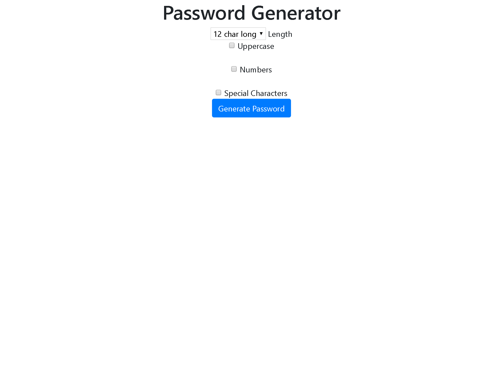

<h1 align="center">
 
  
   
     
  Random Password Generator
   
</h1>

<h4 align="center">Custom and Straightforward Random Password Generator for Python</h4>

Generate an arbitrary string of length n in Python. For example, You want to generate an arbitrary string of fixed length 5.

- Generate a random string of a fixed length.
- Generate a random string with lower case and upper case.
- Generate a random alphanumeric string with letters and numbers.
- Generate random string password which contains the letters, digits, and special characters.

<!--ts-->